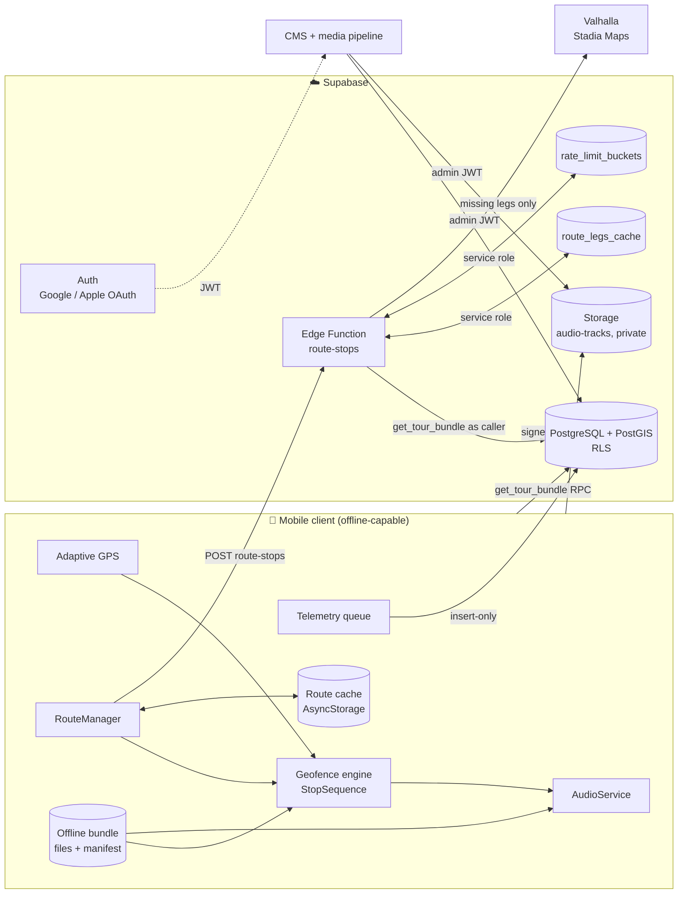
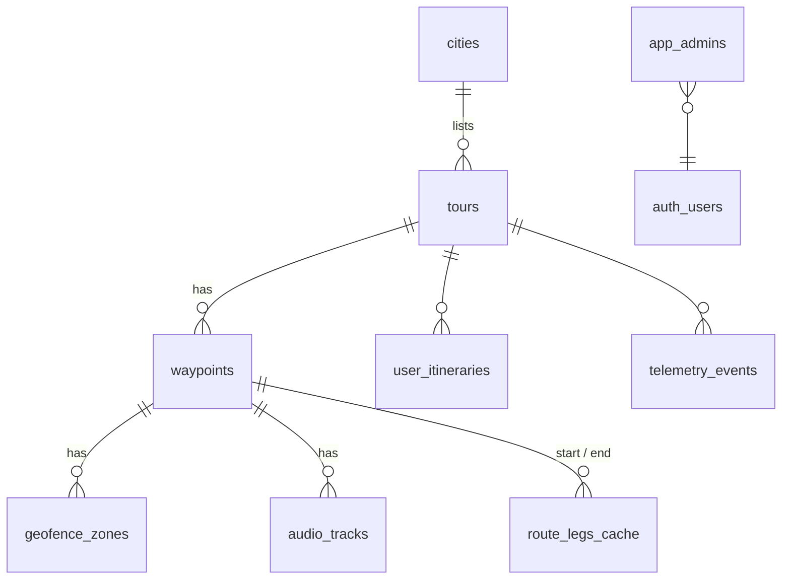
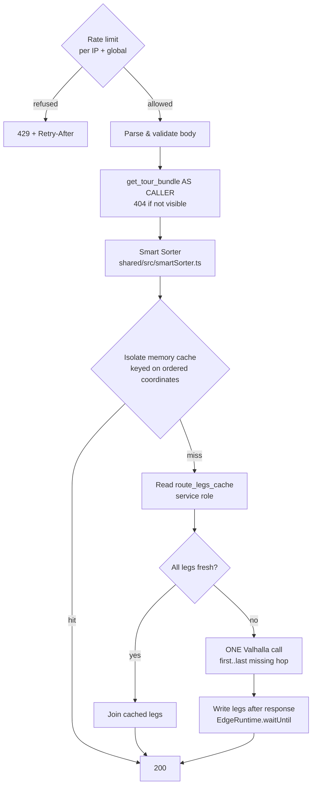
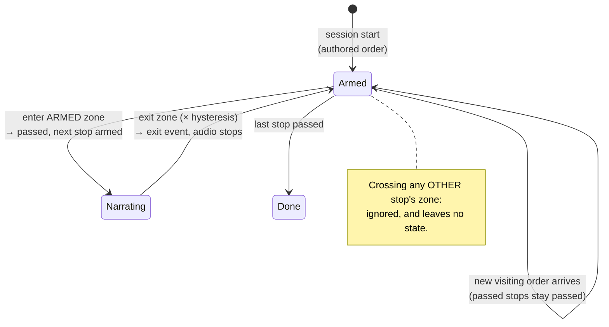

# Audio Tour Platform — System Architecture

> **Single Source of Truth.** This document describes the system as it is
> implemented on `main` after Epic 10 (17 Sep 2026), which is merged and
> **live in production**. Where it disagrees with an
> older document (`prd_user_flows.md`, `architecture_schema.md`), this one wins.
> Where it disagrees with the code, the code wins and this document has a bug.
>
> Anything specified but **not** built is listed in
> [§7 Spec vs. implementation](#7-spec-vs-implementation), never described
> above it as if it were.

| | |
|---|---|
| **Stack** | Supabase (PostgreSQL 15 + PostGIS, Auth, Storage, Edge Functions on Deno) · React Native 0.86 / Expo SDK 57 · TypeScript throughout |
| **Routing** | Valhalla via Stadia Maps, behind the `route-stops` Edge Function |
| **Audio** | AAC-LC `.m4a`, mono 48 kHz, 96 kbps (64 kbps for long tracks), EBU R128 −16 LUFS, **≤ 5 MiB per file** |
| **Status** | Epics 1–10 closed. **Epic 11 (Mobile UI & Onboarding Wizard) is feature-complete and awaiting on-device QA** (§6.4). Its branch `feat/epic-11-onboarding` is **held and NOT merged to `main`** until the engineering team clears that pass, so the mobile code described in §4 is on that branch, not here. Already live in production regardless: the `cities` migration and the `delete-account` Edge Function |

## Contents

1. [Product vision](#1-product-vision)
2. [System overview](#2-system-overview)
3. [Database & backend](#3-database--backend)
4. [Mobile client](#4-mobile-client)
5. [Content & audio](#5-content--audio)
6. [Development workflow](#6-development-workflow)
7. [Spec vs. implementation](#7-spec-vs-implementation) · [Post-MVP backlog](#71-post-mvp-backlog)
8. [Code map](#8-code-map)

---

## 1. Product vision

A hands-free, personalised, location-triggered audio tour. The visitor downloads
a tour, puts the phone in a pocket, and walks; narration starts on its own as
each stop is reached.

### 1.1 Hybrid Offline-First

The network is an **enhancement, never a dependency**. The realistic moment of
connectivity is *before* the walk (hotel wifi, the download screen), not during
it. So:

- **Everything a tour needs to run is on the device** after download: stops,
  geofences, audio, transcripts and the bundled route.
- **Geofencing is computed locally**, per GPS fix, against the downloaded
  bundle. No network call sits between a footstep and narration.
- **Online, the app upgrades** — a live, personalised route from the Smart
  Sorter — and **caches that upgrade to disk** so the next offline session can
  use it.
- **Losing signal never downgrades** what is on screen, and never stops a tour.
- Telemetry queues offline and drains when signal returns.

### 1.2 Personalised routing

Onboarding asks three questions: **group type** (`solo`, `couple`, `friends`,
`family_kids`), **interests** (`history`, `culinary`, `nature`, `architecture`,
`art_culture`) and a **time budget** (`quick` 120 min, `half_day` 240,
`full_day` 480). These ids are also the database tag vocabulary. Culinary is
one tag: street food, markets and fine dining are how the screen presents it,
not separate ids (PM, Epic 11). Before them, the app picks the **city**, which
scopes Discovery (§4). The preferences personalise a tour in three layers:

| Layer | Where | Effect |
|---|---|---|
| **Tour fit** | Device | Discovery lists tours that fit the time budget first. |
| **Stop selection** | Device, offline | Stops whose audience/interest tags do not match are dropped from the session: no pin, no geofence. Untagged stops always stay. A tour is never narrowed below 2 stops. |
| **Visiting order** | Server Smart Sorter; device predicts it offline | The order the stops are walked and narrated, scored from preferences and the visitor's local time of day. |

### 1.3 Hands-free background audio

Narration plays with the screen locked, the phone in silent mode, and the app
in the background. Location tracking continues in the background with the
visitor's permission. The lock screen shows the current stop. A tour ends only
when the visitor ends it; reaching the last stop just offers to.

---

## 2. System overview



---

## 3. Database & backend

### 3.1 Schema (PostgreSQL + PostGIS)

All spatial columns are SRID 4326. Distance queries use `geography` casts (with
matching indexes), never degree arithmetic.



| Table | Purpose | Key constraints |
|---|---|---|
| `cities` | A city visitors can choose (Epic 11). `slug`, `name`, `country_code`, `center` (geography Point). | Readable only while the city has a published tour; admin-only writes. |
| `tours` | A tour. `city_id` (nullable; required to publish), `status` draft/published/archived, `topology` (in_city, point_to_point, star_loop), `transit_mode` (walking, biking, driving), `audiences[]`, `interests[]`, optional bundled `route` (LineString), derived start point. | Tags ⊆ vocabulary functions; route valid with ≥ 2 points. |
| `waypoints` | A stop. `geom` Point, `sort_order` (authored order), `poi_type` (anchor, transition, viewpoint, facility), `audiences[]`, `interests[]`. | GiST + geography indexes. |
| `geofence_zones` | Trigger zone per stop: `radius` (with `trigger_radius_meters`) or `polygon`. | Radius zones must carry a radius. |
| `audio_tracks` | One file per stop per `track_kind` (`narration`, `deep_dive`). `storage_path` (bucket-relative, never a URL), `size_bytes`, `duration_seconds`, `format`, `lufs_normalization`. | Unique per (waypoint, kind); relative path; `format` **AAC only**, path must end `.m4a`; **`size_bytes` ≤ 5,242,880**. |
| `route_legs_cache` | Durable cache of routed legs between two stops (Epic 8). | **Service role only**; RLS on with no policies. |
| `rate_limit_buckets` | Token buckets for `route-stops` rate limiting (Epic 10). `UNLOGGED`: a crash leaves every bucket full. | **Service role only**; RLS on with no policies; written only through `consume_rate_limit()`. |
| `app_admins` | CMS administrators roster. | Deny-all RLS; read only via `is_cms_admin()`. |
| `telemetry_events` | Append-only product analytics. | Insert-only for clients; unique `client_event_id`. |
| `user_itineraries`, `user_itinerary_waypoints` | Per-user saved itineraries with `sync_pull_itineraries()`. | Owner-only RLS. *Not yet used by the app.* |

**`get_tour_bundle(tour_id)`** is the one read the app needs: a JSON manifest of
tour metadata, stops with coordinates, tags, geofences, `narration` /
`deep_dive` media (path, size, duration, transcript), the bundled route and a
`bundle_version_hash` that changes whenever any of it changes. It runs **as the
caller**, so RLS decides visibility: published tours for everyone, drafts for
CMS admins.

### 3.2 Authentication & authorisation

- **Supabase Auth** issues **JWTs** (1-hour expiry). Sign-in is **OAuth2 via
  Google and Apple**; email sign-up is disabled; anonymous sign-in is off.
- **Sign-in on the phone is optional (Epic 11, TASK-1102).** Guest is the
  default and loses nothing: every grant the app uses is `TO anon, authenticated`,
  and telemetry is keyed by device, not user. Apple (iOS) and Google hand an ID
  token to `signInWithIdToken`, with no browser redirect. Google stays hidden until
  `EXPO_PUBLIC_GOOGLE_WEB_CLIENT_ID` (and, on iOS, `EXPO_PUBLIC_GOOGLE_IOS_CLIENT_ID`)
  are set.
- **The session is encrypted at rest** (`secureSessionStorage.ts`). An AES-256-GCM
  key in the Keychain/Keystore, `AFTER_FIRST_UNLOCK_THIS_DEVICE_ONLY` so a
  locked-phone tour can still read it; the ciphertext is in AsyncStorage. A
  keychain read that throws keeps the session and is retried on foreground. A
  session whose key is gone (restored from a backup) is discarded, which signs
  the user out, and never crashes.
- **Account deletion (TASK-1104, App Store 5.1.1(v)).** Settings > Account >
  Delete account calls the `delete-account` Edge Function. The function takes
  the user ONLY from the verified token, refuses CMS administrators (403; the
  team removes those), and hard-deletes with `auth.admin.deleteUser`. That
  cascades to identities, sessions and `user_itineraries`. Apple users confirm
  with Apple first; the fresh authorization code lets the function revoke their
  Apple tokens when the `APPLE_*` secrets are set (recommended by Apple, not
  required; deletion never depends on it). Telemetry is not deleted because it
  is not linked to accounts: events carry a random device id and no user id.
  Downloads and preferences stay on the phone.
- **Authorisation lives in the database, not in roles.** Because the anon key
  is public and OAuth sign-in is open to anyone with a Google or Apple account,
  `TO authenticated` grants nothing on its own. Every protected policy and RPC
  checks one of:
  - **`is_cms_admin()`**: the caller's `auth.uid()` is in `app_admins`
    (`SECURITY DEFINER`, pinned `search_path`).
  - **Published-ness**: `tour_is_published()`, `waypoint_is_published()`,
    `audio_object_is_published()`.
  - **Ownership**: `user_id = auth.uid()`.
- **Storage bucket `audio-tracks` is private.** Clients receive **signed URLs**
  (1-hour life) only for objects belonging to published tours. Uploads and
  deletes need `is_cms_admin()`. **5 MiB (5,242,880 bytes) file limit** per
  object, enforced by Storage itself. MIME allowlist `audio/mp4`, `audio/m4a`,
  `audio/x-m4a`, `text/vtt`: `.m4a` audio and transcripts only. The uploader
  declares the type, so the allowlist catches mistakes and is not a security
  boundary.

### 3.3 CMS API

The CMS writes only through **`cms_*` RPCs**, each opening with
`assert_cms_admin()`. They run as the signed-in admin (not `SECURITY DEFINER`),
so RLS remains the enforcement layer.

| RPC | Does |
|---|---|
| `cms_upsert_tour` | Create/update tour metadata and tags (tags normalised by `cms_normalise_tags`). |
| `cms_replace_tour_waypoints` | Replace a tour's stops and geofences atomically from JSON. |
| `cms_register_audio_track` | Register an uploaded file for a stop and track kind. |
| `cms_set_tour_route` | Store the bundled route polyline (validated against the stops). |
| `cms_set_tour_city` | Put a tour under a city. Cannot be cleared. |
| `cms_validate_tour` | Report everything that blocks publishing, including `tour_without_city`. |
| `cms_publish_tour` / `cms_set_tour_status` | Lifecycle transitions. |

The **ingest service** (`backend/cms`) carries the **admin's own access token**,
never a service-role key: every write stays attributable to a person and
subject to RLS. The **media pipeline** (`backend/media`) normalises and encodes
audio before upload (see §5.2).

### 3.4 `route-stops` Edge Function & the Smart Sorter

`POST /functions/v1/route-stops`: a Deno Edge Function that orders a tour's
stops and returns a walkable route through them.

```jsonc
// Request
{
  "tour_id": "uuid",
  "waypoint_ids": ["uuid", "…"],              // 2–20, authored order
  "transit_mode": "walking",
  "preferences": { "group_type": "couple", "interests": ["history"] },
  "context": { "local_time": "2026-09-17T18:40:05+03:00" }   // offset REQUIRED
}
// 200
{
  "encoding": "polyline", "precision": 6, "polyline": "…",
  "length_meters": 1240, "duration_seconds": 930,
  "legs": [{ "length_meters": 410, "duration_seconds": 300 }],
  "waypoint_ids": ["uuid", "…"],              // THE ORDER ROUTED
  "sort_strategy": "scored", "sorter_version": "v2"
}
```

**Request pipeline:**



Authorisation always runs **before** either cache, so a cached route is never
served to a caller who could not see the tour. The response header
`X-Route-Cache` reports `hit`, `legs`, `partial` or `miss`.

#### Smart Sorter

Pure, deterministic and dependency-free: the **same file** runs in Deno (server),
Node (tests) and Metro (the app, offline). Strategies, in precedence order:

| Strategy | When | Order |
|---|---|---|
| `scored` | Request carries `context.local_time` (every app build since Epic 9) | **Nearest neighbour with a score bonus.** Start at the stop nearest `preferences.start`, else the lowest `sort_order`; then repeatedly go to the stop maximising **(10 + score) / max(metres, 30)**. |
| `order_index` | No context, and every stop has a `sort_order` (older app builds) | Authored order. |
| `nearest_neighbour` | Otherwise | Greedy nearest-next. |

**Score rules** (additive; every weight is a constant in `SCORE_WEIGHTS`):

| Rule | Points |
|---|---|
| Base (every stop) | 10 |
| Per matching interest | +10 |
| Stop's audiences include the visitor's group | +6 |
| Morning (06:00–11:00 local) and stop tagged `culinary` | +8 |
| `viewpoint` in the golden hour (90 → −20 min to sunset) | +30 |
| `viewpoint` in the shoulder (150 → 90 min to sunset) | +15 |
| Stop tagged `nature` in the golden hour | +8 |

Sunset is computed per date and location (NOAA algorithm), not a fixed hour.
The **distance heuristic** makes a stop worth a detour in proportion to its
score: an interest match is worth twice the walk, a golden-hour viewpoint four
times. The 30 m floor keeps co-located stops from dividing by zero; the base of
10 lets an unscored tour degrade to plain nearest neighbour. Ratio ties go to
authored order.

*Known limitations:* greedy, so a matched stop under 2× as far can be visited
first and the walk doubles back. Time rules score the **request** time, not
predicted arrival time.

#### Segment-based leg cache (`route_legs_cache`)

A route through *N* stops is *N − 1* legs, each cached independently, so a
reordered or partially changed tour reuses every leg it shares with an earlier
route.

| Rule | Why |
|---|---|
| **14-day TTL** (`LEG_TTL_MS`), enforced by the reader | Map data and seasonal closures go stale. |
| **Trigger invalidation**: a stop's location or tags change, or a tour's status or transit mode change, deletes affected legs | Content edits apply at once. The trigger is `SECURITY DEFINER` because CMS writes run as `authenticated`, which has no privilege on the table. It compares values, because a CMS Save rewrites every column. |
| **`coords_key`** must match the stops' current coordinates | Closes the race where a background write lands a leg for a stop moved mid-request. |
| **At most one provider call** per request, spanning the first to last missing hop | Stadia bills per request, not per leg. |
| **Service role only** | A writable shared cache would let anyone forge a route onto every phone. |
| **The cache never fails a request** | Read errors route uncached; write errors are logged. |

#### Rate limiting ("The Shield")

Every `POST` spends one token from **two buckets at once, or from neither**.
This runs before the body is read or the database is asked:

| Bucket | Default | Protects against |
|---|---|---|
| **Client**: per IP (IPv6 grouped by /64) | burst 20, refill 10/min | One device or script bursting |
| **Global**: the whole function | burst 300, refill 120/min | IP rotation draining the routing budget |

- **State is in Postgres** (`consume_rate_limit()`, service role), not isolate
  memory. Requests spread across isolates, so a per-isolate counter would
  multiply the limit by the isolate count.
- **All-or-nothing:** a request refused by its IP bucket does not drain the
  global bucket.
- **No raw IPs are stored.** The bucket key is an HMAC of the address, keyed by
  a server secret.
- **Address source:** `cf-connecting-ip`, then `x-real-ip`, then the first
  `x-forwarded-for` entry. No address means the global bucket only, logged once
  per isolate. **Spoofing was verified closed on production (17 Sep 2026):**
  forged `X-Forwarded-For`, `X-Real-IP` and `True-Client-IP` headers do not
  change a caller's bucket, and Cloudflare rejects a client-supplied
  `cf-connecting-ip` with 403 before it reaches Supabase.
- **Fails open:** if the store errors or takes longer than 1 s, the request
  proceeds and `route_stops_rate_limit_unavailable` is logged. It is also off
  without the service role key.
- **Tunable without a redeploy** through secrets
  `ROUTE_RATE_LIMIT_{CLIENT,GLOBAL}_{BURST,PER_MINUTE}`.
- A refusal returns **`429 too_many_requests`** with `Retry-After` in seconds.
  The provider's own limit stays `429 rate_limited`. For a visitor, a refusal
  only delays the live route: the bundled route stays drawn.

**Status codes the app relies on:** `404` / `501` and other permanent 4xx mean
*stop asking this session*; `401`, `408`, `429` and `5xx` are retried with backoff.

---

## 4. Mobile client

React Native + Expo SDK 57, Zustand stores. **Screens observe, they never
own:** `TourSessionController` is the single owner of GPS and audio hardware.


**Onboarding (Epic 11).** Welcome is shown once. Its primary action is
*Continue without account*; Apple (iOS) and Google sign-in are optional (§3.2).
The City step appears only when two or more cities have published tours. With
one, it is selected silently; with no city list (offline first run), Discovery
resolves it later. Discovery lists the saved city's tours, plus any tour with no
city. Downloaded tours shown offline are never filtered by city. Bundles stay
per tour, downloaded from Tour Detail. The rules are pure functions in
`personalization/onboardingFlow.ts`, covered by `test:ui`.

### 4.1 Offline pre-fetch bundle

Tapping **Download** on Tour Detail:

1. Calls `get_tour_bundle` and stores the manifest.
2. Plans every file: narration, Deep Dives and `.vtt` transcripts beside their
   audio.
3. Requests **signed URLs** (1 h) and downloads through `DownloadManager`:
   - a bounded queue of 3 concurrent transfers;
   - **pause/resume persisted across app launches**, with a fallback to a fresh
     transfer when a resume hits an expired signed URL;
   - progress measured against **declared** `size_bytes`, so the bar is right from
     the first byte;
   - **every file is size-checked exactly** against the manifest, and a
     truncated file fails the bundle.
4. Unlocks **Start Tour** only at 100%.

Files live under `<documents>/<tourId>/media/<storage_path>`. A new
`bundle_version_hash` means a new bundle. If a file later disappears from disk
while online, playback streams the same object through a signed URL instead,
and **fetches that track's `.vtt` transcript alongside it** (held in memory,
never written into the bundle), so the karaoke text survives the fallback. A
bundled transcript always wins over a streamed one.

### 4.2 Adaptive GPS

Sampling trades battery against precision **per transit profile**, escalating
near the zone that matters:

| Profile | Trigger radius | Coarse | Fine | Escalate within | Exit hysteresis | Cooldown |
|---|---|---|---|---|---|---|
| Walking | 15–30 m (25) | 10 s / 25 m | 2 s / 5 m | 120 m | × 1.6 | 10 min |
| Biking | 50–80 m (65) | 6 s / 40 m | 1.5 s / 15 m | 300 m | × 1.5 | 5 min |
| Driving | 150–300 m (220) | 4 s / 100 m | 1 s / 25 m | 900 m | × 1.4 | 3 min |

Three defences against thrashing the GPS:

- **Distance hysteresis:** de-escalate only 25% beyond the escalation distance.
- **20 s dwell time** between applied tier changes.
- **Serialised watcher restarts.**

The tier is measured to the **armed** stop, plus any zone the visitor is inside,
not to stops scheduled later. Foreground uses a position watcher. Background uses
a registered TaskManager task, swapped on app state so exactly one subscription
is live. An orphaned background task left by a killed app is stopped on the next
cold start.

> Background location needs a development build (not Expo Go). On Android,
> background tracking pauses until the planned foreground service lands.

### 4.3 Local geofencing engine — strictly linear

Containment is computed on the device, not with OS geofencing. iOS caps OS
regions at 20 and supports no polygons, and OS events cannot be tuned for
hysteresis. Radius zones use haversine; polygon zones use ray casting.

**`StopSequence` arms exactly one zone: the next stop in the visiting order.**



Per GPS fix:

1. **Exits first.** Every zone the visitor is inside is tested against the
   **widened** boundary (radius × hysteresis), so edge jitter cannot cause an
   enter/exit storm.
2. **Then at most one entry:** the armed stop's, against its true boundary.
   Entering passes the stop and arms the next, which is first evaluated on the
   *following* fix.

- **No replay.** A narrated stop is never re-armed, however long the visitor is
  away (PM-approved, Epic 9). This supersedes the cooldown as the replay guard;
  the cooldown check stays as a safety net.
- **Stops without a geofence** are passed automatically, so they cannot block
  the tour.
- **Manual trigger** (tap a pin, debug builds) plays a stop and **skips ahead**
  past any unreached stop before it.
- **An exit only stops the track its own stop owns**, so overlapping exit zones
  cannot silence the stop just entered.

> **Authoring rule:** space stops so that `gap > (r_a + r_b) × exitHysteresisFactor`.
> Clearing the *entry* radii is not enough.

### 4.4 Routing & adherence to the server's `waypoint_ids`

`RouteManager` keeps the map's route right as connectivity changes, and keeps
**narration order identical to the drawn route**.

**What is drawn**, best first:

1. **`dynamic`**: a live or cached route in the Smart Sorter's order.
2. **`static`**: the bundled route, in authored order.
3. **`straight`**: dashed lines between stops in narration order.

**Fetch policy.** Every session requests a live route whenever online, filtered
or not, once the cache has been read, until one live route arrives. Each attempt
carries `context.local_time` (device wall clock **with its UTC offset**, stamped
per attempt) and the **preferences snapshot taken at session start**. Editing
preferences mid-walk reshuffles nothing. The app makes up to 3 attempts, with
backoff of 5 s then 20 s. A reconnect retries at once, and a connection dropped
mid-request does not spend an attempt.

**Adherence rules:**

| Situation | Map | Narration order | Cache |
|---|---|---|---|
| Live route validates and `waypoint_ids` names exactly the session's stops | Live route | **`waypoint_ids`** | Written under that order |
| Live route without `waypoint_ids` (pre-Epic-8 server) | Live route | The authored order it was sent | Written under that order |
| `waypoint_ids` does not match the session's stops | Rejected | Unchanged | Not written |
| Route fails validation (wrong precision, misses a stop) | Rejected | Unchanged | Not written |
| Offline, cache hit for the **predicted** order | Cached route | Predicted order | — |
| Offline, no cached route for that order | Static or straight | Authored | — |

Every route, whether live, cached or bundled, is decoded at its **declared**
precision and checked to pass within tolerance of every stop before it is drawn.
A new order arriving mid-walk re-sequences the engine and keeps progress.

#### Order-dependent cache

- **Key:** `route:dynamic:v2:<tourId>:<bundleHash>:<ordered waypoint ids>`. A
  morning order and a sunset order for the same stops are separate entries.
- **Written only under the order the server actually routed**, so a hit always
  pairs a route with a matching narration order.
- **Offline lookup needs the order before the server can give it**, so the app
  runs the **same Smart Sorter** (`predictStopOrder`) with the session's
  preferences and current local time, then reads that key. If the prediction
  diverges from the server (for example a newer sorter version), the cost is a
  cache miss, never a mismatched route.
- **Online, the server is asked even on a hit**, and its answer replaces the
  cached route and order.
- No bundle hash means no caching. `v1` keys (unordered) are never read.

### 4.5 Telemetry

`telemetry_events` records `tour_started`, `tour_completed`,
`bundle_downloaded`, `geofence_entered`, `audio_started`, `audio_completed`,
`audio_skipped`, `audio_stopped` and `audio_paused`, stamped with app version and
platform. Events are queued on disk, sent in all-or-nothing batches (insert only;
no upsert or select), deduplicated by `client_event_id`, and drained on app
start, on foreground and on reconnect. KPI views: `v_kpi_audio_completion`,
`v_kpi_audio_dropoff`, `v_kpi_deep_dive_completion`.

---

## 5. Content & audio

### 5.1 Content hierarchy

| Kind | Model | Behaviour |
|---|---|---|
| **Anchor POI** | `waypoints.poi_type = 'anchor'` + `narration` track | The main stops. Geofence-triggered, strictly in visiting order. |
| **Transition audio** | `poi_type = 'transition'` + `narration` track | Navigation cues between anchors ("turn left at…"), on the same geofence and sequence rules. Shown on the map as *Navigation cue*. |
| **Viewpoint / facility** | `poi_type = 'viewpoint'` / `'facility'` | Viewpoints are boosted near sunset by the Smart Sorter. |
| **Deep Dive** | `audio_tracks.track_kind = 'deep_dive'` | Optional long-form audio for a stop, **chosen, not triggered**. It survives a zone exit (the listener usually walks on) and is displaced only by the next stop's narration. |
| **Transcript** | `<audio path>.vtt` beside each track | Downloaded with the bundle; found by naming convention, never a stored path. |

### 5.2 Audio engineering standard

The media pipeline (`backend/media`) enforces this; nothing reaches the bucket
that has not passed it.

| Parameter | Value | Why |
|---|---|---|
| **Codec / container** | **AAC-LC in `.m4a`** | The only codec native on both iOS and Android. **Opus was abandoned:** iOS cannot decode it and fails *silently* (reports playing, stuck at 0:00). |
| **Loudness** | **EBU R128, −16 LUFS integrated**, two-pass linear `loudnorm` | Mobile/podcast convention. |
| **True peak** | −1.5 dBTP (re-measured ceiling −1.0) | AAC encoding adds 0.5–1 dB of overshoot. |
| **Verification** | Encoded file **re-measured**; must land within ±1.0 LU | `lufs_normalization = -16` is stored only when it is true. |
| **Channels / rate** | Mono, 48 kHz explicit | Halves bundle size; stops `loudnorm` handing the encoder a 192 kHz stream. |
| **Bitrate** | 96 kbps; **64 kbps** when a track would not fit 5 MiB at 96 | 96 is transparent for speech (≈ 2.2 MB for a 3-minute stop). The approved range is 64–96 kbps. The bitrate is chosen from the probed duration **before** encoding, and a step-down adds a warning. |
| **Filter** | 80 Hz high-pass | Removes handling noise and wind rumble below the voice. |
| **Limits** | Source ≤ 60 min and ≤ 500 MiB; **output ≤ 5 MiB** (5,242,880 bytes: about 6.8 min at 96 kbps, 10 min at 64); transcript ≤ 512 KiB | PM hard limit (Epic 10). The same number is enforced in four places: pipeline, bucket `file_size_limit`, the `audio_tracks` CHECK and `npm run test:cms`, which pins them together. A longer recording is refused before encoding, with a message to split it. |

`audio_tracks.format` is always `AAC`, and the path must end `.m4a`. Both are
validated constraints, and `cms_register_audio_track` refuses any other
extension. **MP3, raw ADTS `.aac` and Opus are not supported** (PM, Epic 10).
The extension must match the codec because AVFoundation infers the format from it.

### 5.3 Playback logic

| Behaviour | Implementation |
|---|---|
| **Background & lock screen** | `playsInSilentMode`, `shouldPlayInBackground`, lock-screen metadata per stop. |
| **Interruptions** | `interruptionMode: 'doNotMix'`: other audio pauses ours; we never mix under it. |
| **Ducking** | **None.** Removed by PM decision (TASK-502); volume is always unity. See §7. |
| **Replay prevention** | The linear sequence: a narrated stop is never re-armed. Exit hysteresis prevents boundary bounce. The per-profile cooldown remains as a guard. |
| **Zone exit** | An exit stops **only the track its own stop owns**, recorded as `audio_stopped`. The fade is **not yet implemented**; the stop is abrupt. See §7. |
| **Deep Dive** | Survives its stop's exit; the next stop's narration displaces it. |
| **Failure safety** | `.opus/.ogg/.oga/.webm` refused on iOS before a player is created. 5 s load and 8 s stall watchdogs, because `expo-audio` has no error event. Every failure resets the transport UI rather than leaving it at "playing 0:00". |
| **Subtitles** | WebVTT sidecar parsed on the device (cue text, entities and voice tags handled; a sentence-level subset). The line under the playhead is highlighted, with right-to-left text supported, and a seek moves the highlight at once. A streamed track's transcript is fetched beside it (§4.1). |

---

## 6. Development workflow

### 6.1 Epics, atomic tasks and Handover Reports

- Work is organised into **Epics**, each broken into **atomic tasks**
  (`TASK-<epic><nn>`, e.g. `TASK-903`). A task is one reviewable, testable
  change.
- **Each task ends with a Handover Report**, and the **next task waits for PM
  approval**. A Handover Report states:
  1. **What changed** — behaviour first, then files.
  2. **Decisions needed** — structural risks and spec conflicts, flagged
     *before* they ship, with a recommendation. The PM decides.
  3. **Deviations** from the brief, and why.
  4. **Verification** — what ran, with results, and what did **not** run.
  5. **Next step** awaiting approval.
- **Engineering stance:** challenge assumptions before executing. Read what a
  change does to live data before running it.

### 6.2 Branch, commit, merge

1. Branch from `main`: `feat/epic-<n>-<slug>` or `docs/<slug>`.
2. Commit per task: `TASK-<id>: <what changed>`.
3. Push; **CI must be green**. `main` is updated by **fast-forward merge only**.

| CI workflow | Runs on | Checks |
|---|---|---|
| `checks.yml` | Every push | Typecheck backend + shared and the mobile app; routing, CMS contract, app logic (`test:ui`), auth storage and account deletion (`test:auth`) and telemetry tests; Deno typecheck and Edge Function tests |
| `db-verify.yml` | Changes to migrations, seed, `config.toml` | Fresh `supabase db reset`, bundle verification as anon, generated types match `backend/types/supabase.ts` |

### 6.3 Rules that cost hours when forgotten

- **Every schema migration updates both seed files** (`supabase/seed.sql`,
  `prod_test_seed.sql`).
- **Production migrations:** `supabase db push --dry-run`, read the list, then
  `supabase db push --yes`.
- **Never run `types:generate` blind:** errors are written into
  `backend/types/supabase.ts`.
- **`TO authenticated` is a public grant** (§3.2).
- **Never put the auth session back in plain AsyncStorage**, and never weaken
  its keychain accessibility to `WHEN_UNLOCKED`: the background tour runs locked.
  `npm run test:auth` asserts both.
- **Keep `shared/` free of npm imports and use real `.ts` specifiers:** Deno,
  Node and Metro all consume it.
- **The onboarding → `route-stops` payload is a pinned contract** (TASK-1103):
  `shared/src/contracts/route-stops.onboarding.json`. `test:ui` drives the real
  preferences store through the wizard and must build its `request` exactly;
  `test:edge` sends that request to the real handler and must get its
  `expected_order`. The stops are placed so ONLY the full preferences reorder
  them, so a side that drops `group_type` or an interest fails. Change the wire
  shape there first. The time budget and city are deliberately not in the
  request: they pick the tour, not the route.
- **Manual harnesses** (not in CI, hit a real project): `npm run sim:walk`
  (end-to-end geofence → offline file → audio), `npm run routing:ping`.

### 6.4 Epic 11 — feature-complete, awaiting device QA

Branch `feat/epic-11-onboarding` (head `0622216`), CI green. **Not merged to
`main`**: the on-device pass owns animations, UI scaling at large text sizes,
the native Apple/Google flows, offline states, and the one path no automated
test could reach — deleting a real account with live Apple and Google test
accounts.

| Task | Built | Live in production? |
|---|---|---|
| **TASK-1101** Onboarding | Welcome → City → Group → Interests → Time (§4). Interests are tinted bubbles led by a featured Culinary bubble; time budgets 120/240/480 min. WCAG AA contrast is computed by `test:ui`, which also fixed a pre-existing failure in the TASK-601 cards (`colors.inkSecondary`). | **Yes, the `cities` migration** (18 Sep). Backfilled the Tel Aviv tour; every bundle hash unchanged. The app itself is on the branch. |
| **TASK-1102** Session & auth | Guest-first: sign-in is optional and grants nothing on the server. The session is encrypted with AES-GCM from `expo-crypto`, keyed from the Keychain/Keystore so a locked-phone tour can still read it (§3.2). | No (branch) |
| **TASK-1103** Wire contract | `shared/src/contracts/route-stops.onboarding.json` pins the wizard → `route-stops` payload for both sides (§6.3). | n/a (test fixture) |
| **TASK-1104** Account deletion | Settings → Account → Delete account, and the `delete-account` Edge Function: hard delete, CMS admins refused, Apple token revocation when the secrets are set (§3.2). Telemetry is deliberately **not** purged — it carries a random device id and no user id, so nothing in it is account-linked, and linking it would be the less private design. | **Yes, the function** (18 Sep). Live checks passed: 405/401/400, and a real admin session refused with 403 while keeping its CMS rights. |

---

## 7. Spec vs. implementation

Items specified in product documents that the code does **not** do today. Each
needs a PM decision or a task; none should be assumed.

| Spec | Reality | Status |
|---|---|---|
| **Audio ducking** to 20% under navigation prompts | Removed; `doNotMix`, unity volume | PM decision TASK-502. The PRD is out of date. |
| **Zone-exit fade-out** (2 s) | Abrupt stop (`fadeOutAndStop` TODO) | Post-MVP backlog (PM, Epic 11 wrap-up). Deferred from Epic 1; the stepped volume ramp is not built. |
| **Opus** encoding | AAC-LC only | Abandoned (iOS). Do not reintroduce. |
| **Max 1.5 MB per file** (PRD) | 5 MiB hard limit, 64–96 kbps | Superseded by PM decision (Epic 10, TASK-1002). Live in production since 17 Sep 2026 (migration `20260917180100`). |
| **Skip to next stop** for a missed zone | Only the debug manual trigger; a missed zone blocks the remaining stops | Post-MVP backlog |
| **Proximity-based start** (`preferences.start`) | Not sent; scored routes start at the first authored stop | Post-MVP backlog |
| **In-app account deletion** (App Store guideline 5.1.1(v)) | Built (TASK-1104); the `delete-account` Edge Function is **live in production** since 18 Sep 2026 | Two things outstanding before submission: the `APPLE_TEAM_ID` / `APPLE_KEY_ID` / `APPLE_CLIENT_ID` / `APPLE_PRIVATE_KEY` secrets, without which Apple token revocation is skipped (recommended by Apple; deletion is compliant without it), and one live deletion of a real account during device QA — this workstation has no service-role key and signup is closed, so no throwaway user could be made. |
| **Future trip planning** (travel dates, time-simulated routing) | Routing scores the device's current `context.local_time`; onboarding asks for no dates | Post-MVP backlog (PM, Epic 11 kickoff). The server already takes any `local_time`, so the backend gap is small; the work is the dates UI and offline bundles for a trip that is weeks away. |
| **Precise kids' ages** scoring | One `family_kids` audience tag; no ages collected | Post-MVP backlog (PM, Epic 11 kickoff) |
| **User-selectable bicycle / car modes** | Walking only in onboarding. `transit_mode` belongs to the tour, and `route-stops` refuses a mismatch (400 `transit_mode_mismatch`) | Post-MVP backlog (PM, Epic 11 kickoff). The engine already has biking/driving profiles, but geofence radii are authored for each tour's own mode, so this is a content change as well as a code change. |
| **Rate limiting** of `route-stops` | Per-IP + global token buckets in Postgres (§3.4) | Live in production since 17 Sep 2026 (TASK-1001). The global 120/min is PM-approved **for now**, to be recalibrated when the Stadia budget is final. |
| **MP3 fallback** (TASK-301) | Removed: not uploadable, not registrable, refused by the format constraint | AAC-LC `.m4a` only (PM, Epic 10). `transcript_path_for()` / `sidecar.ts` still map `.mp3`; that branch is unreachable. |
| **"Public CDN"** audio URLs (PRD Screen 2) | Private bucket, 1-hour signed URLs | PRD is out of date. |
| **Android background tracking** | Pauses in the background | Foreground service planned |
| **Cloud sync of preferences and itineraries** | Nothing syncs. Preferences and downloads are per device; `user_itineraries` and `sync_pull_itineraries()` exist but no client uses them | Post-MVP backlog (PM, Epic 11 wrap-up). **This is what would give an account user-facing value** - in the MVP it deliberately grants nothing (PM, 18 Sep), which is what the Welcome copy says. |

### 7.1 Post-MVP backlog

Everything above marked *Post-MVP backlog*, in one place. Each is a PM decision
already taken, not a maybe; none is scheduled.

| Item | Why it is not in the MVP |
|---|---|
| **Future trip planning** (travel dates, time-simulated routing) | Valid use case (PM), but it complicates every time-based rule; routing scores the device's clock today. |
| **Bicycle / car routing modes**, user-selectable | `transit_mode` belongs to the tour and its geofence radii are authored for that mode, so this is a content change too. |
| **Precise kids' ages** scoring | The generic `family_kids` tag carries the MVP; ages would need their own vocabulary and content tagging. |
| **Cloud sync of preferences and itineraries** | The feature that would give an account user-facing value; in the MVP an account deliberately grants nothing. |
| **Zone-exit fade-out** (2 s) | Deferred from Epic 1; narration stops abruptly at a zone exit. |
| **Skip to next stop** for a missed zone | Only the debug trigger exists, so a missed zone blocks the rest of the tour. |
| **Proximity-based start** (`preferences.start`) | The server supports it; the app does not send it, so routes start at the first authored stop. |

---

## 8. Code map

| Area | Path |
|---|---|
| Migrations & seeds | `supabase/migrations/`, `supabase/seed.sql`, `prod_test_seed.sql` |
| Edge Functions | `supabase/functions/route-stops/` (`handler.ts` contract, `legCache.ts`, `routeCache.ts`, `rateLimit.ts`); `supabase/functions/delete-account/` (`handler.ts` contract, `appleRevoke.ts`) |
| Shared (Deno + Node + Metro) | `shared/src/` (`smartSorter.ts`, `polyline.ts`, `routeTolerance.ts`, `routing/valhalla.ts`) |
| CMS ingest | `backend/cms/` |
| Media pipeline | `backend/media/` (`presets.ts` is the audio standard, per-file limit and bitrate planning) |
| Session owner | `mobile/src/session/TourSessionController.ts` |
| GPS + geofencing | `mobile/src/services/location/` (`LocationService.ts`, `stopSequence.ts`, `geometry.ts`) |
| Transit profiles | `mobile/src/config/transitProfiles.ts` |
| Routing | `mobile/src/routing/` (`RouteManager.ts`, `routeDecision.ts`, `routeRequest.ts`), `mobile/src/services/routing/` |
| Offline bundle | `mobile/src/services/bundle/` |
| Audio | `mobile/src/services/audio/AudioService.ts` |
| Transcripts | `mobile/src/transcript/` |
| Telemetry | `mobile/src/services/telemetry/` |
| Personalisation | `mobile/src/personalization/` (`preferencesStore.ts` is persisted, v2; `onboardingFlow.ts`, `cityCatalogue.ts`) |
| Onboarding screens | `mobile/src/screens/onboarding/`, `mobile/src/components/onboarding/` |
| Auth (optional sign-in) | `mobile/src/services/auth/` (`secureSessionStorage.ts`, `authStore.ts`, `AuthService.ts`, `accountDeletion.ts`, `AccountService.ts`) |
| Settings & account | `mobile/src/screens/SettingsScreen.tsx`, `DeleteAccountScreen.tsx`, `mobile/src/components/auth/SignInButtons.tsx` |
| Tests & harnesses | `mobile/scripts/` (`test-ui-logic.ts`, `test-auth.ts`, `simulate-walk.ts`), `backend/scripts/` |
